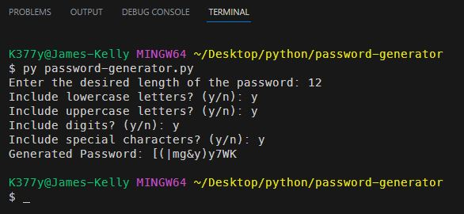

# Password Generator

## *Description*
This project allows you to create a random passwords based on user-specified criteria, such as length and character types. Includes practice using the random and string Python modules.
 
 

### ***Some notes about the Python String module:*** 
 - string.ascii_lowercase: A string containing all lowercase letters of the English alphabet ("abcdefghijklmnopqrstuvwxyz"). 
 - string.ascii_uppercase: A string containing all uppercase letters of the English alphabet ("ABCDEFGHIJKLMNOPQRSTUVWXYZ"). 
 - string.digits: A string containing all decimal digits ("0123456789"). 
 - string.punctuation: A string containing all ASCII punctuation characters (!"#$%&\'()*+,-./:;<=>?@[\\]^_{|}~`). 
 - These will be used to create a string of all possible characters to choose from when generating the password based on the user's input.
 
 

## *Installation & Usage*
To install this app, simply clone the repository and run the `password-generator.py` file in your terminal.
 
 
When prompted: 
 - Choose the length of your password 
&emsp; - The limitations of the Random module limits the generator to be between 8 - 128 characters 
&emsp; - Due to using  `"".join(random.choice(character_pool) for _ in range(length))`, the password can be any `length` that the user specifies. 
 - Choose whether to include lowercase letters 
 - Choose whether to include uppercase letters 
 - Choose whether to include numbers 
 - Choose whether to include special characters 
 

 

## *Questions*
<h3>Portfolio:&emsp;<a href="https://jk377y.dev" target="_blank">https://jk377y.dev</a></h3>
<h3>Email:&emsp;<a href="mailto:jk377y@gmail.com" target="_blank">jk377y@gmail.com</a></h3>
<h3>LinkedIn:&emsp;<a href="https://www.linkedin.com/in/james-kelly-software-developer/" target="_blank">https://www.linkedin.com/in/james-kelly-software-developer/</a></h3>
<h3>GitHub:&emsp;<a href="https://github.com/jk377y" target="_blank">https://github.com/jk377y</a></h3>
 
 

## *License*

 Copyright (c) 2023 James Kelly
 Information on this license can be found at: (https://opensource.org/licenses/MIT)